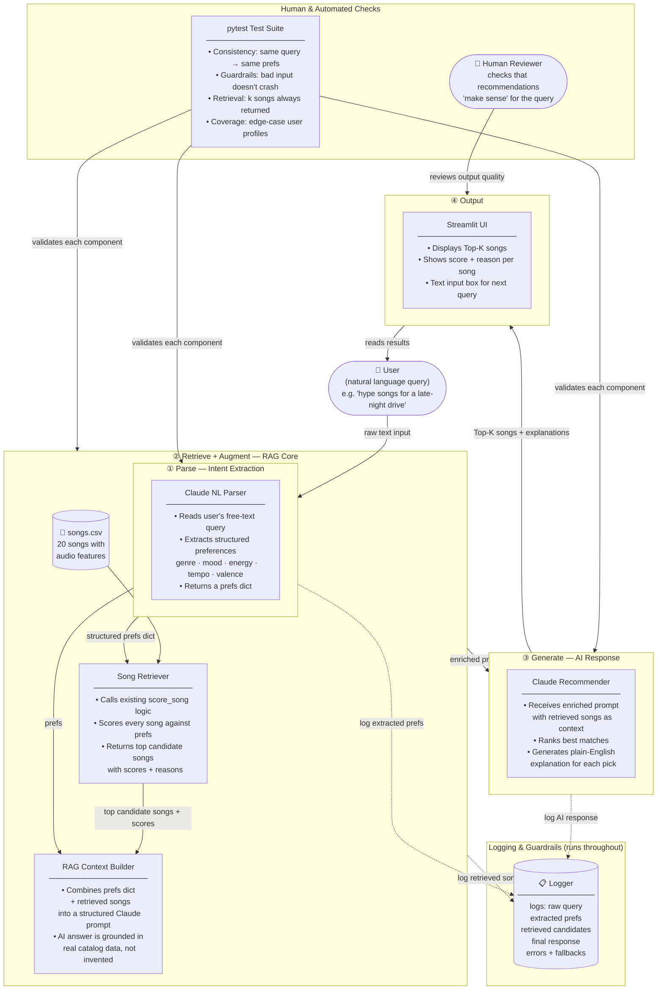

# System Diagram — Natural Language Music Recommender (RAG)

## Architecture Overview



---

## Data Flow Summary

| Step | Component | Input | Output |
|------|-----------|-------|--------|
| 1 | **Claude NL Parser** | Free-text query | Structured prefs dict |
| 2 | **Song Retriever** | Prefs dict + songs.csv | Scored candidate songs |
| 3 | **RAG Context Builder** | Prefs + candidates | Enriched Claude prompt |
| 4 | **Claude Recommender** | Enriched prompt | Top-K songs + explanations |
| 5 | **Streamlit UI** | Recommendations | User-facing display |

---

## Why This is RAG (Not Just a Chatbot)

Without RAG, Claude would guess song recommendations from training data.
With RAG, Claude's answer is **grounded in the actual catalog** — it can only recommend songs that exist in `songs.csv`, with accurate feature values.

```
Without RAG:  User query ──→ Claude ──→ made-up recommendations
With RAG:     User query ──→ Retrieve from catalog ──→ Claude ──→ grounded recommendations
```

---

## Where Humans Are Involved

1. **Query input** — user writes the natural language query
2. **Output review** — human reads recommendations and judges if they feel right
3. **Test authoring** — developer writes pytest cases for consistency and edge cases
4. **Guardrail tuning** — developer adjusts logging + error handling based on observed failures
